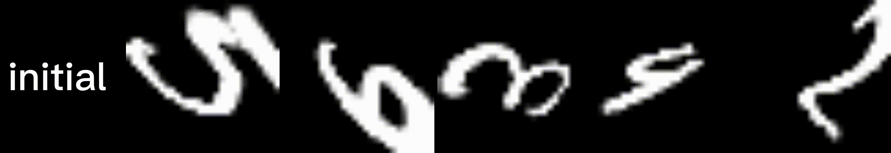

# Warped Convolution Networks for Homography Estimation

**This project is the official PyTorch implementation of WCN.**

[comment]: <> (### [Paper]&#40;https://arxiv.org/abs/2112.&#41;)

  

- Codes will be realeased soon.

